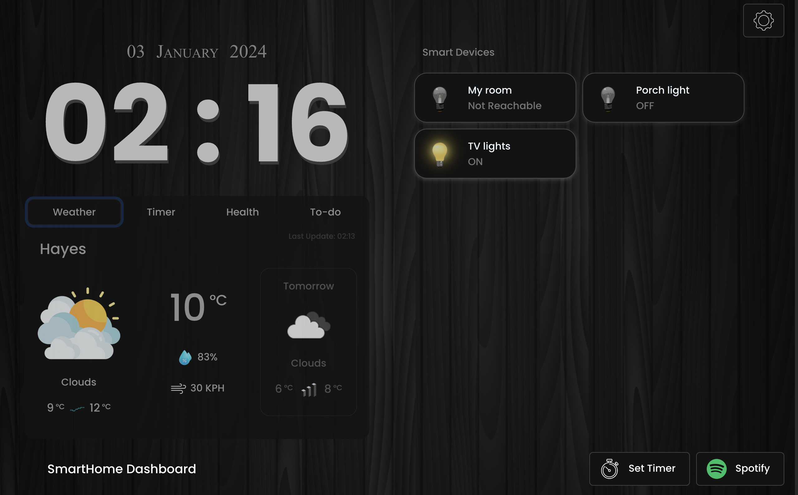
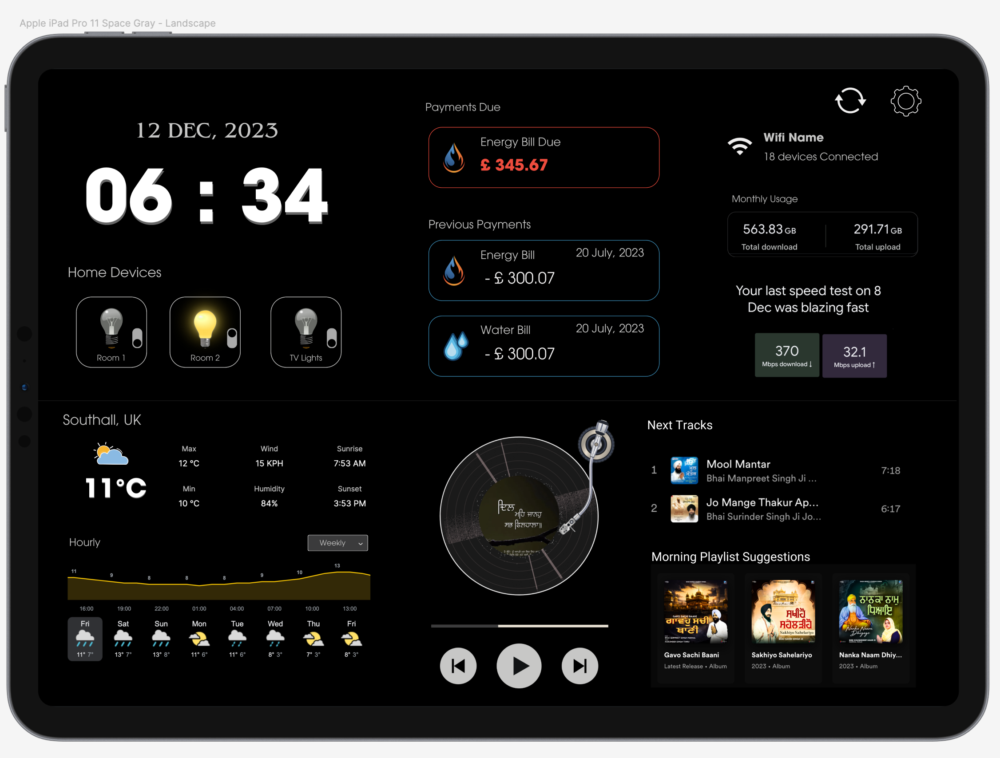

# SmartHome-Dashboard
 The SmartHome-Dashboard on tablet screens offers ultimate convenience. Control music playlists, track bills, manage WiFi, adjust Google Home lights, and get real-time weather updates—all on a single screen. 

## Table of Contents

1. [Introduction](#introduction)
2. [Features](#progress-update)
3. [Screenshots](#current-design)
4. [Credits](#credits)

### Introduction
- The project is still in progress therefore the server and installation details are not yet available. For any information, reach out to me at gsgghotra@gmail.com

### Progress Update
- The time displays correctly
- Smart devices controls are working, used [Philips-hue-Developers](https://developers.meethue.com/develop/get-started-2/)
- Added (Weather Dashboard) and add weather info [Weather Dashboard](https://github.com/gsgghotra/Weather-Forecast-Dashboard)
- Spotify works but still need a lot of work
- Added settings option (Themes)

#### Current Design

- Vinyl design for music player is removed due to UX reasons. Design is available on another project [Harmony Heal](https://github.com/gsgghotra/HarmonyHeal)

### Next steps
- Explore the way to open (open.spotify) on ipad as background 
- Football Data [api-football](https://www.api-football.com/)
- Implement Bill tracker [Bill Tracker](https://github.com/gsgghotra/BillTracker)
- Google Assistant SDK [Assistant SDK](https://developers.google.com/assistant/sdk)

### Initial Designs

### Credits:
Developer - [LinkedIn - Gurjeet Singh](https://www.linkedin.com/in/gsgghotra/)

API's used:
[Spotify Web API ](https://developer.spotify.com/documentation/web-api)
and
[day.js](https://day.js.org/)